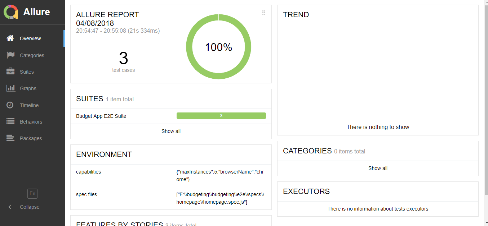
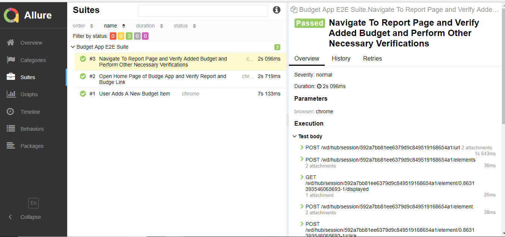

###  Test Plan For Budget App:
    
    This is a brief test plan for budgeting app which covers the features to be tested, the approach and testing libraries
    used to test the app.
   
   Three Features To be Covered in Test Plan
  
  ###### Add Budget Item
  ###### On Home Page Report and Budget Links are Shown
  ###### Add a New Budget Item and Verify its updated on Reports
  
 ###  Test Automation Libraries Used to Test Budgeting App:

  1. WebDriverIO (for writing functional UI tests)
  2. Jasmine (Test Runner which runs each spec as independently)
  3. Jest (Javascript testing library used for UI assertions)
  4. Allure-reporter ( Generates report via command line post test run) example report for budget app is shown below:
  5. Page-Objects for better design for scalability and reuseability
  

  
  ### How to SetUp and Run Tests:
  
  1. clone the url containing e2e tests for app using command `git clone https://github.com/rehansulehria/WebDriverIO-Jasmine.git`
  2. on root folder of the project run `npm install`. It will install all project dependencies.
  3. once all depencies are installed. Run `npm start` to run the local webserver for budeting app.
  4. Now run `npm test` to run the Tests.
  5. Command line spec reporter will display status of each run.
  6. Once tests run is complete. Run `allure generate` to general html allure report as shown in screenshot above.
  

